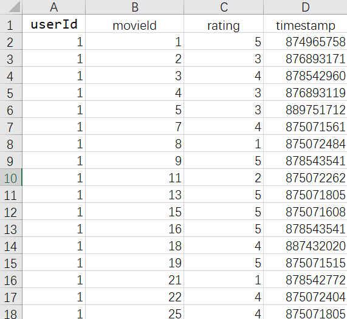
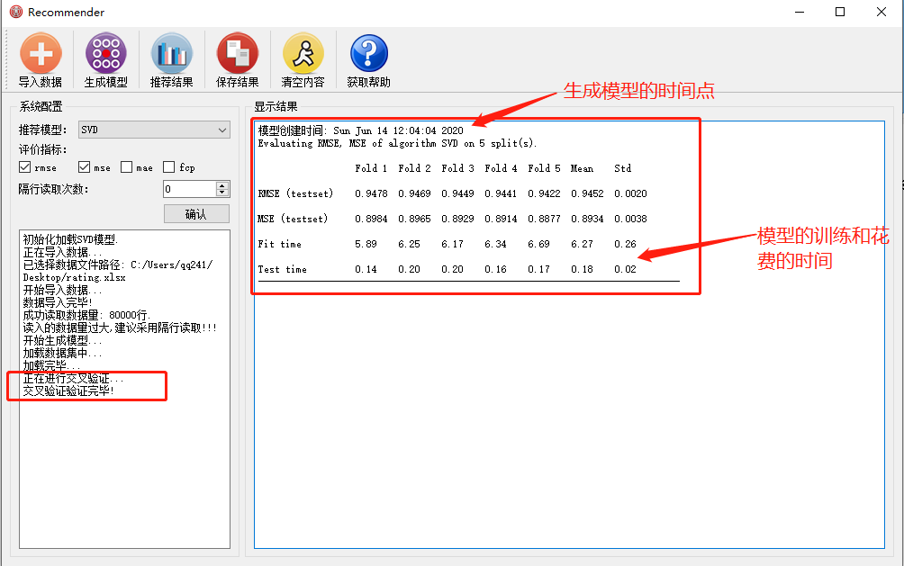

# RecommendSystem
使用Pyqt5开发了一个小型的推荐软件，做到输入用户-商品评分文件，就可以调用目前较为完备的推荐算法生成用户的预测评分。

# 简介  
这是一个学习周期很长的项目，跨度从大二到大四，终于有一天觉得不行了，必须要拿出点什么东西，于是就开发了这个东西**Recommender**,我觉得前面 还有加一个**small**才恰当。我开发了这个推荐系统软件。这个软件可以在x64位win10系统直接运行。这个推荐系统软件实现的主要功能是导入用户对商品的评分数据，之后再根据不同的推荐模型，生成用户对商品的预测评分，进而实现对用户的推荐。

## 功能介绍
该软件主要有以下功能：导入数据、生成模型、推荐结果、保存结果、情况内容、获取帮助。软件的初始界面如下图所示。

软件主要分为四个区域，他们分别是**功能选择区域**，**系统配置区域**，**结果显示区域**，**进程监控区域**。如图1-1所示软件区域上方就是功能选择区域，在这里通过点击图标可以调用不同的功能；在系统配置区域用户可以根据实际情况选择不同的推荐模型，具体情况如图1-2所示，软件提供了十种目前最流行的推荐模型。  

在**系统配置区域**我们还可以选择不同的评价指标来评价在不同推荐模型、不同数据集下推荐模型的准确度，软件初始化选择了两种MSE和RMSE这两种评价指标。

$$\large{MAE=\frac{1}{|\hat{R}|}\sum\limits_{{{r}_{ui}}\in \hat{R}}{|{{r}_{ui}}-{{{\hat{r}}}_{ui}}|}}$$

$$\large{MSE=\frac{1}{|\hat{R}|}\sum\limits_{{{r}_{ui}}\in \hat{R}}{{{({{r}_{ui}}-{{{\hat{r}}}_{ui}})}^{2}}}}$$

$$\large{RMSE=\sqrt{\frac{1}{|\hat{R}|}\sum\limits_{{{r}_{ui}}\in \hat{R}}{{{({{r}_{ui}}-{{{\hat{r}}}_{ui}})}^{2}}}}}$$

$$\large{\begin{cases}
& FCP=\frac{{{n}_{c}}}{{{n}_{c}}+{{n}_{d}}}\text{  } \\ 
& n_{c}^{u}=|\{(i,j)|{{{\hat{r}}}_{ui}}>{{{\hat{r}}}_{uj}}\text{ }and\text{ }{{r}_{ui}}>{{r}_{uj}}\}| \\ 
& {{n}_{c}}=\sum\limits_{u}{n_{c}^{u}}\text{ }and\text{ }{{n}_{d}}=\sum\limits_{u}{n_{d}^{u}} \\ 
\end{cases}}$$

指标MAE、MSE、RMSE、都是在测量度量用户对商品的预测评分和实际评分之间的误差，而指标FCP则是在度量预测用户对商品的预测评分排序和实际评分的误差。小图显示了勾选了全部评级指标之后的具体情况。  

**系统配置**还设置有隔行读取，这主要是为了解决输入的用户-商品评分数据量过大的问题，如图1-4所示，用户-商品评分数据集越大生成的结果集会大很多，只能通过减少数据量来解决这个问题，随机读取容易造成用户的评价商品减少，所以我们采取隔行读取来剪切数据量，隔行读取一次，数据量就减少一半。如图1-5和图1-6所示。  

软件的主要界面是结果显示，结果显示界面主要拿来显示模型的推荐精度和前一百个用户的推荐的结果。进程监控则实时显示了软件的进程，让用户可以看到程序进行到了哪一步骤。

## 操作流程
以下展示了Recommender的运行主要流程图，如图2-1所示。软件在执行过程中总体按照图2-1中流程进行。  

## 具体操作

### 导入数据

软件可以通过点击导入数据图标来导入数据，点击了图标之后，会打开文件选择对话框，提示用户选择你要导入的数据文件，具体内容如下图3-1所示，对于导入的数据文件的格式要严格要求，主要格式是<user_id,item_id,rating,[timestamp]>,其中timestamp为可选参数，具体情况见下图3-1所示。软件支持导入的数据类型有：xlsx，xls,csv。  

### 生成模型
如果导入数据成功，进程监控区域会显示“数据导入成功”，这个时候就可以点击“生成模型”图标，执行生成推荐模型的操作，如下图所示。  

生成的模型会根据系统配置时勾选的评价指标，在“显示结果”区域展示生成的模型评价结果，结果内容还包括生成模型的时间点、模型训练所花费的时间和测试所花费的时间。详细情况如下图所示。  

### 生成推荐结果
当推荐模型生成完毕，就可以生成推荐结果了，点击“推荐结果”图标，会生成如下图所示的推荐结果，结果只显示前一百个用户的推荐结果。  

如果没有生成推荐模型就执行生成推荐结果操作，那么进程监控区域会提示用户“没有生成推荐模型”内容，具体内容如下图所示。

### 保存结果
点击“保存结果”按钮，可以将推荐结果保存到特定的电脑路径，如下图所示，保存推荐结果到电脑桌面。  

保存成功，如下图所示。  

## 清空内容
点击“清空内容”图标，会将“显示结果”区域的内容全部清除。

## 获取帮助
点击软件“获取帮助”图标“显示结果”区域会显示，软件的大体介绍，已经提供作者的的邮箱和当前这个项目维护网站。
